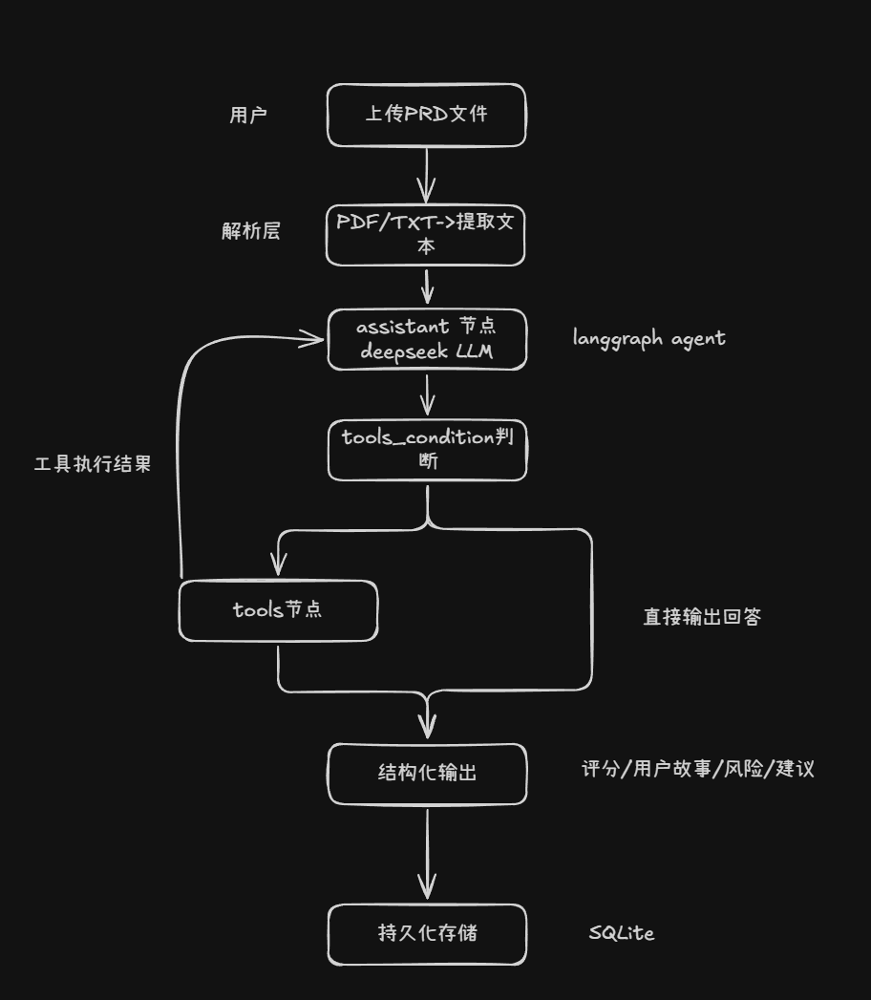
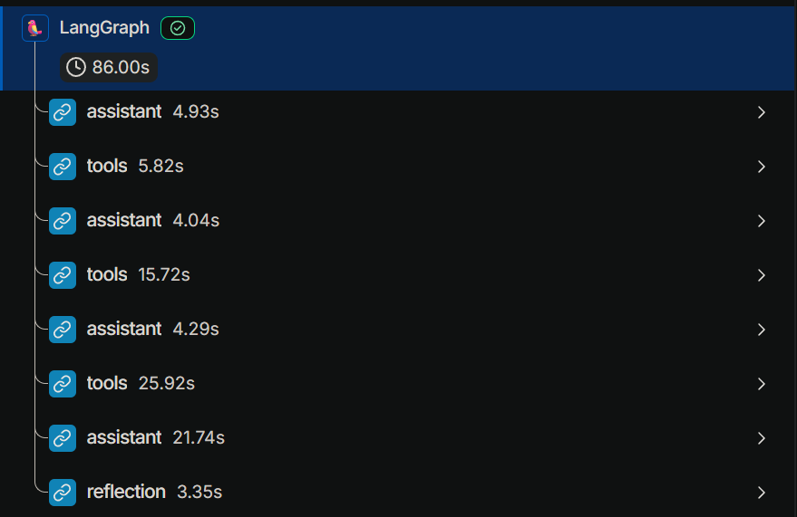
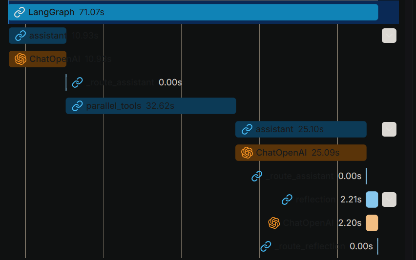

# PRD Review Agent

> 基于 RAG 增强 + LLM-as-Judge 自修正的智能需求评审系统

上传 PRD 文档，自动获得结构化评审报告


---

## 解决什么问题

产品评审会议平均返工 2-3 次，核心原因是需求描述不清晰、验收标准缺失、技术风险未识别。

传统做法依赖人工经验，效率低且标准不一致。本项目用 AI Agent 自动完成评审工作：工具内部通过 RAG 召回行业规范作为评判依据，输出结构化报告，并通过 Reflection 机制对报告质量做二次验证。

---

## 系统架构

```
用户上传 PRD
      ↓
 assistant（主分析节点）
      ↓ 调用工具（内部 RAG 增强）
 ┌────┼────┐
 ↓    ↓    ↓
完整性 用户  风险
检测  故事  识别
 └────┼────┘
      ↓ 综合三个工具结果生成报告
 reflection（LLM-as-Judge 质量验证）
      ↓ 不合格则重试，最多 2 次
    最终报告 + 历史库写入
```



### RAG 双层知识库

| 知识库 | 内容 | 作用 |
|---|---|---|
| 行业规范库 | PRD完整性标准、用户故事INVEST原则、风险识别清单、评分体系、常见缺陷模式 | 每次工具调用时 RAG 召回，作为 LLM 的评判依据 |
| 历史评审库 | 每次评审完自动写入 | 下次评审相似 PRD 时召回历史案例作参考 |

---

## 核心功能

- ✅ **RAG 增强评审**：工具调用时从行业规范知识库检索相关标准，LLM 对照规范分析，而非自由发挥
- ✅ **Reflection 自修正**：LLM-as-Judge 对评审报告做质量验证，不合格自动重试（上限 2 次）
- ✅ **需求完整性检测**：对照 8 个维度逐一检查，给出 0-100 评分和缺失原因
- ✅ **用户故事规范化**：自动提取并按 INVEST 原则规范化，附带可量化验收标准（AC）
- ✅ **技术风险识别**：覆盖高危/中危风险和常见需求缺陷模式
- ✅ **多轮追问**：持续对话，支持针对报告的深度追问
- ✅ **对话历史持久化**：基于 LangGraph SqliteSaver，会话状态跨请求保持

---

## 评估结果（Eval Pipeline）

使用 LLM-as-Judge 自动化评估 Pipeline，对 3 个梯度测试用例、12 项检查项进行验证：

| 测试用例 | 完整性评分 | 缺失字段识别数 | 用户故事数 | 风险关键词覆盖 |
|---|---|---|---|---|
| 低质量PRD（社交APP） | 20/100 ✅ | 8个 ✅ | 3条 ✅ | 并发/数据/安全/隐私 ✅ |
| 中等质量PRD（电商平台） | 30/100 ✅ | 8个 ✅ | 5条 ✅ | 库存/超卖/并发/支付 ✅ |
| 高质量PRD（知识库系统） | 45/100 ❌ | 7个 ✅ | 4条 ✅ | 搜索/权限/安全/隐私 ✅ |

**总体通过率：11/12（91.7%）**  
平均响应时间：70s（3个工具并行调用 + Reflection 验证；并行架构响应时间 ≈ max(单工具)

> 唯一失败项：高质量PRD评分偏低（45 vs 期望 55+），Agent 对完整 PRD 存在过度扣分的倾向，待优化评分 prompt。

---

## 可观测性（LangSmith）

接入 LangSmith 实现全链路追踪，可视化每次评审的 Agent 调用链、token 消耗和节点延迟。




每次评审完整执行 8 个 graph steps：assistant → tools（×3）→ assistant（生成报告）→ reflection，单次消耗约 13.5K tokens。

---

## 技术栈

| 模块 | 技术 |
|---|---|
| Agent 框架 | LangGraph（StateGraph + SqliteSaver checkpointer）|
| 大模型 | DeepSeek API |
| RAG 向量库 | ChromaDB + langchain-chroma |
| Embedding | BAAI/bge-m3（SiliconFlow）|
| 评估框架 | LLM-as-Judge（自研 eval.py）|
| 可观测性 | LangSmith |
| 界面 | Streamlit |
| 文档解析 | PyPDF |

---

## 快速开始

```bash
# 1. 克隆项目
git clone https://github.com/sysxdc/prd-review-agent.git
cd prd-review-agent

# 2. 配置环境变量
cp .env.example .env
# 填入 DEEPSEEK_API_KEY、OPENAI_API_KEY（SiliconFlow key）、EMBED_BASE_URL

# 3. 安装依赖
pip install -r requirements.txt

# 4. 初始化 RAG 知识库（首次运行）
python -c "from rag_store import _get_standards_store; _get_standards_store()"

# 5. 启动
streamlit run app.py
```

---

## 踩坑记录

**坑1：PDF解析乱码**  
直接用 decode() 读取 PDF 会乱码，改用 pypdf 库解析后解决。

**坑2：对话历史重复输出**  
Agent 返回所有消息记录，只取最后一条 AIMessage 解决。

**坑3：ChromaDB filter 语法报错**  
`langchain-community` 的 Chroma 已废弃，且新版 ChromaDB 多条件 filter 需用 `$and` 包裹。
升级为 `langchain-chroma` 并使用单字段 filter 后解决。

**坑4：Streamlit Cloud 部署失败**  
requirements.txt 包含整个 Python 环境导致安装失败，精简为只保留项目依赖解决。
